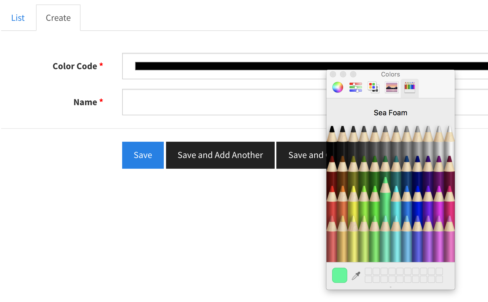
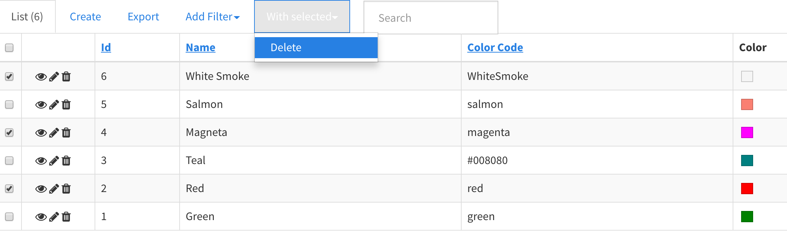

# Color

One of the aspects of product is color. Therefore, colors should be created first before product.

## Add New Color

To add new color, click the `Create` tab in the Color section. Then, select color by clicking the color bar and give the color name you like. Finally, click `Save`.

## View, Edit, and Delete

* Click `eye` icon for viewing a color details.
* Click `pencil` icon for editing a color.
* Click `bin` icon for deleting a color.

### Multi-Delete

If you want to delete multiple items, select each one and click `With Selected > Delete` link.

