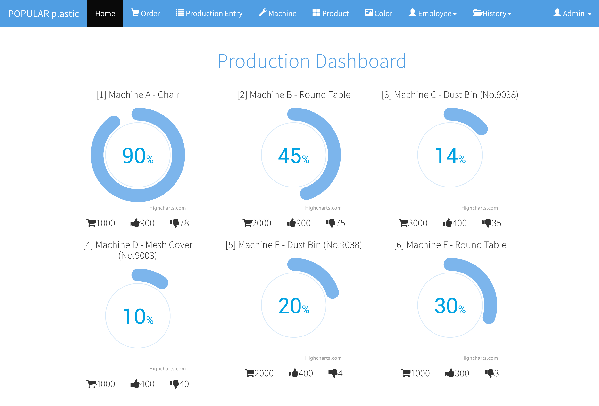

# Dashboard

The dashboard shows all `IN_PROGRESS` orders status in real time with the 30 seconds interval. Each donut chart represents an order running on a machine with production entry details:

* Order Quantity
* Number of Good
* Number of Bad

