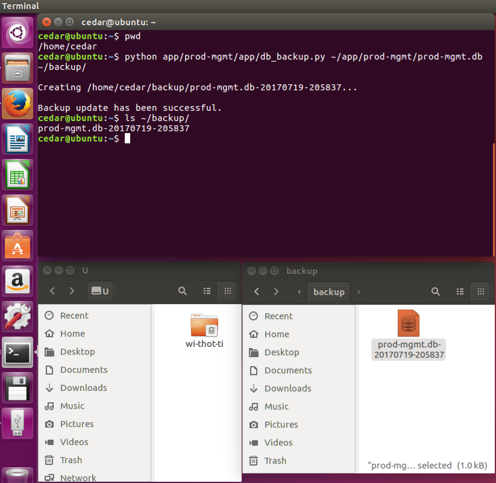

# Database Backup

Whenever you want to backup the existing database, you can run this backup command and later transfer it to an external drive.

* Open a new Terminal to run these commands:

* [1] Check the current path to make sure it's in `/home/cedar`

```sh
cedar@ubuntu:~$ pwd
```

* [2] Run the backup script.

```sh
cedar@ubuntu:~$ python app/prod-mgmt/app/db_backup.py ~/app/prod-mgmt/prod-mgmt.db ~/backup/
```

* [3] A backup file will be saved into /home/cedar/backup/prod-mgmt.db-{date}-{time}. You can check via the `ls` command as below:

```sh
cedar@ubuntu:~$ ls ~/backup/
```



If you want to copy the backup file to an external USB dirve, click the `Files` drawer icon to open the system hard drive. Then, click on the `backup` folder. Finally, drag prod-mgmt.db-{date}-{time} file to USB drive as shown in the diagram.