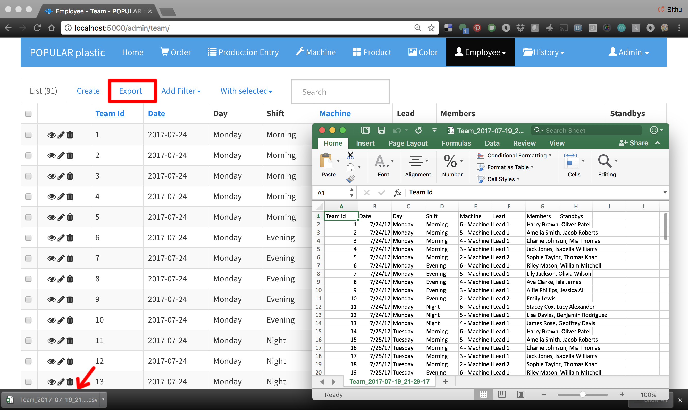

# Data Export

Data from any table can be exported to a CSV file which is accessible from Microsoft Excel.

Click `Export` tab on a table that you want to export and a CSV file will be downloaded into browser's download folder.

Example: Exporting a schedule team list into a CSV file.

