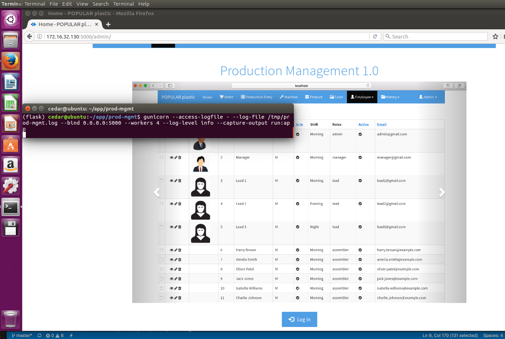
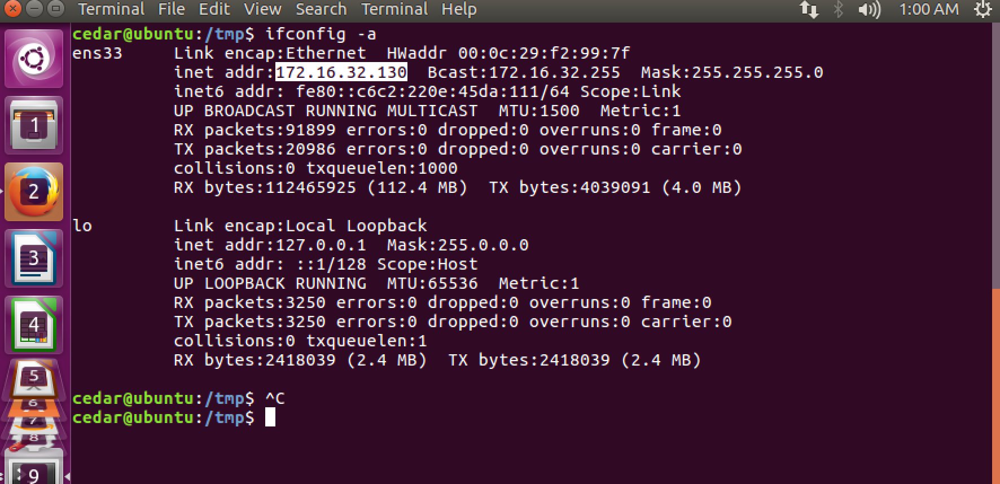
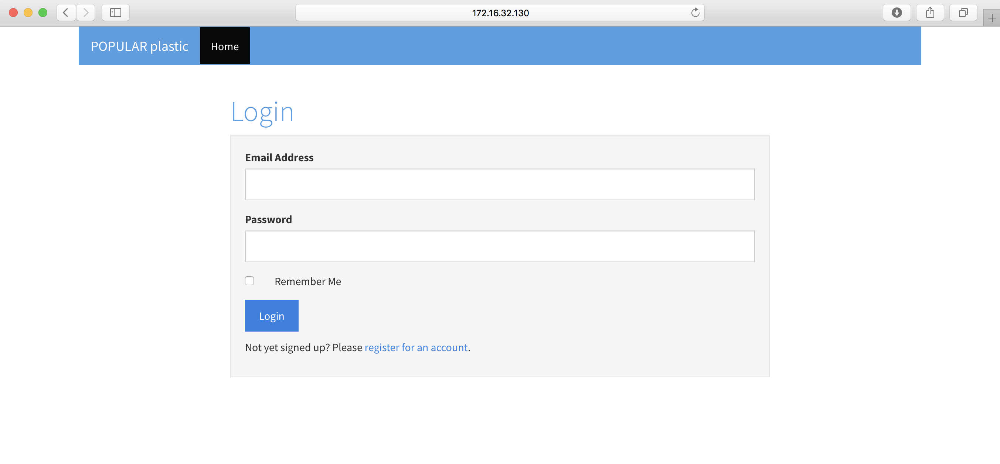

# Run the Application

## Server Startup

Execute this server startup command in the same terminal that you installed the application.

`gunicorn --access-logfile - --log-file /tmp/prod-mgmt.log --bind 0.0.0.0:5000 --workers 4 --log-level info --capture-output run:app`

Example: 
```sh
(flask) cedar@ubuntu:~/app/prod-mgmt$ gunicorn --access-logfile - --log-file /tmp/prod-mgmt.log --bind 0.0.0.0:5000 --workers 4 --log-level info --capture-output run:app
```

Now, you can load the application in a web browser. Note: Open FireFox and enter this URL in the browser.

```sh
http://{MACHINE_IP}:5000/
```



## How to find server machine IP?

Open the another Terminal window and enter this command:

```sh
ifconfig -a
```



## Logging in to the Application

Once you can see the home page in the browser, go ahead and click the `Log In` button at the bottom of the page. Then, it will take you to the `Log In` page.



### Congratulations! You have successfully installed the application.
