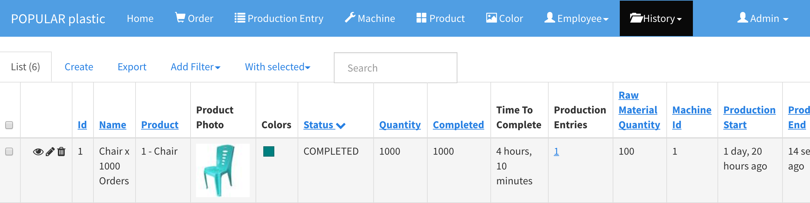

# History

## 1. Order History

`History` > `Order`

As soon as an order is completed, the completed order (`COMPLETED`) will be moved to the order history. Both `Order` and `Production Entry` maintain the `NEW` AND `IN_PROGRESS` order list. However, the order history shows all orders including `NEW` and `IN_PROGRESS`.

## 2. Production Entry History

`History` > `Production Entry`

Likewise to order, all production entries for a completed project will be moved to the production entry history. The production entry with the `IN_PROGRESS` orders will remain in regular the `Production Entry` list.

## 3. Team

`History` > `Team`

All past teams (schedules) will be saved into team history.

