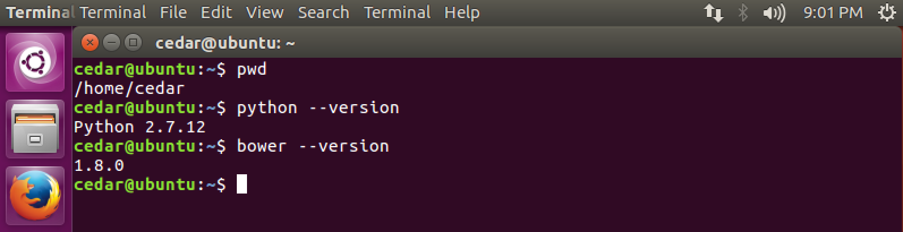
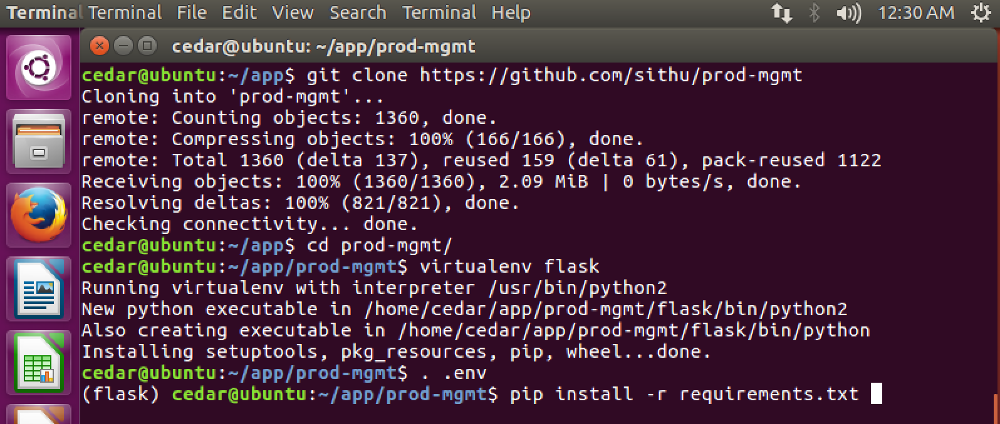
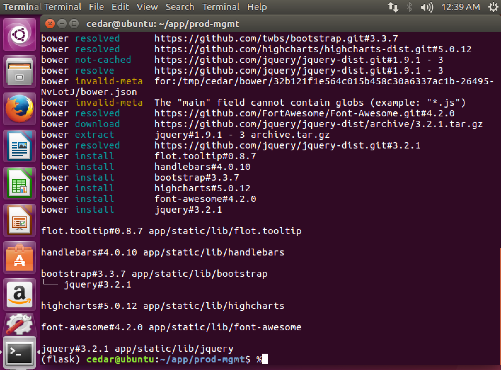

# User Manual

## Software requirements

* Although the application can run on any operation systems, this manual is target for Ubuntu Linux operation system.
* A reliable Internet connection on the server that you are installing.
* Either a static IP or dynamic IP assigned to the server.
* The network or router must allow TCP port `5000` for incoming traffic to the server.
*  Check the server has installed Python 2.7.x.

```sh
python --version
```

*  Check the bower package manager tool is installed.

```sh
bower --version
```



## Hardware requirements

* Dual Core Intel or AMD CPU with 64-bit Architecture.
* 4 GB Memory.
* 20 GB SSD or SATA Hard Drive.
* Ethernet Port Network or Wifi


## Installation

Execute the following commands in a Linux shell Terminal.

* Ping to check the Internet connection. Press Ctl+D to exit.

```sh
cedar@ubuntu:~/app$ ping www.google.com
PING www.google.com (172.217.6.68) 56(84) bytes of data.
64 bytes from sfo07s17-in-f68.1e100.net (172.217.6.68): icmp_seq=1 ttl=128 time=12.0 ms
64 bytes from sfo07s17-in-f68.1e100.net (172.217.6.68): icmp_seq=2 ttl=128 time=14.2 ms
64 bytes from sfo07s17-in-f68.1e100.net (172.217.6.68): icmp_seq=3 ttl=128 time=13.3 ms
64 bytes from sfo07s17-in-f68.1e100.net (172.217.6.68): icmp_seq=4 ttl=128 time=13.9 ms
^C
--- www.google.com ping statistics ---
4 packets transmitted, 4 received, 0% packet loss, time 3006ms
rtt min/avg/max/mdev = 12.046/13.386/14.210/0.844 ms
```

* Create a `app` folder under the current user home path. E.g. /home/cedar. Delete the `app` folder to ensure there is no existing one.

```sh
cedar@ubuntu:~$ rm -rf app
cedar@ubuntu:~$ mkdir app
```

* Create a `backup` folder to store database backup files.

```sh
cedar@ubuntu:~$ mkdir backup
```

* `cd app` - Go inside the app folder you just created.

```sh
cedar@ubuntu:~$ cd app
```

* Check the current path is under `/home/cedar/app`

```sh
cedar@ubuntu:~/app$ pwd
/home/cedar/app
```

* Download the source code:

```sh
cedar@ubuntu:~/app$ git clone https://github.com/sithu/prod-mgmt
```

* Go inside the prod-mgmt folder.

```sh
cedar@ubuntu:~/app$ cd prod-mgmt
```

* Create a Python virtual enviroment.

```sh
cedar@ubuntu:~/app/prod-mgmt$ virtualenv flask
```

```sh
The program 'virtualenv' is currently not installed. You can install it by typing:
sudo apt install virtualenv
```

If you get this error, then you need to install `virtualenv` via:

If it asks for password, enter Cedar's account password.

```sh
cedar@ubuntu:~/app/prod-mgmt$ sudo apt install virtualenv
```


* Load the virtual environment. Then, you should able to see `(flask)` at the beginning of the command prompt.

```sh
cedar@ubuntu:~/app/prod-mgmt$ . .env
(flask) cedar@ubuntu:~/app/prod-mgmt$
```

* Install all required Python PIP modules. At the end, you should see all the installed Python packages as below:

```sh
(flask) cedar@ubuntu:~/app/prod-mgmt$ pip install -r requirements.txt
```




If you get this error: `failed with error code 1 in /tmp/pip-build-g7tapu/Pillow/`, then you run this apt-get install command and re-run the `pip install` command.

```sh
(flask) cedar@ubuntu:~/app/prod-mgmt$ sudo apt-get install python-dev
(flask) cedar@ubuntu:~/app/prod-mgmt$ pip install -r requirements.txt
```

* Finally, install all front-end JavaScript and CSS libraries.

```sh
(flask) cedar@ubuntu:~/app/prod-mgmt$ bower install
```




