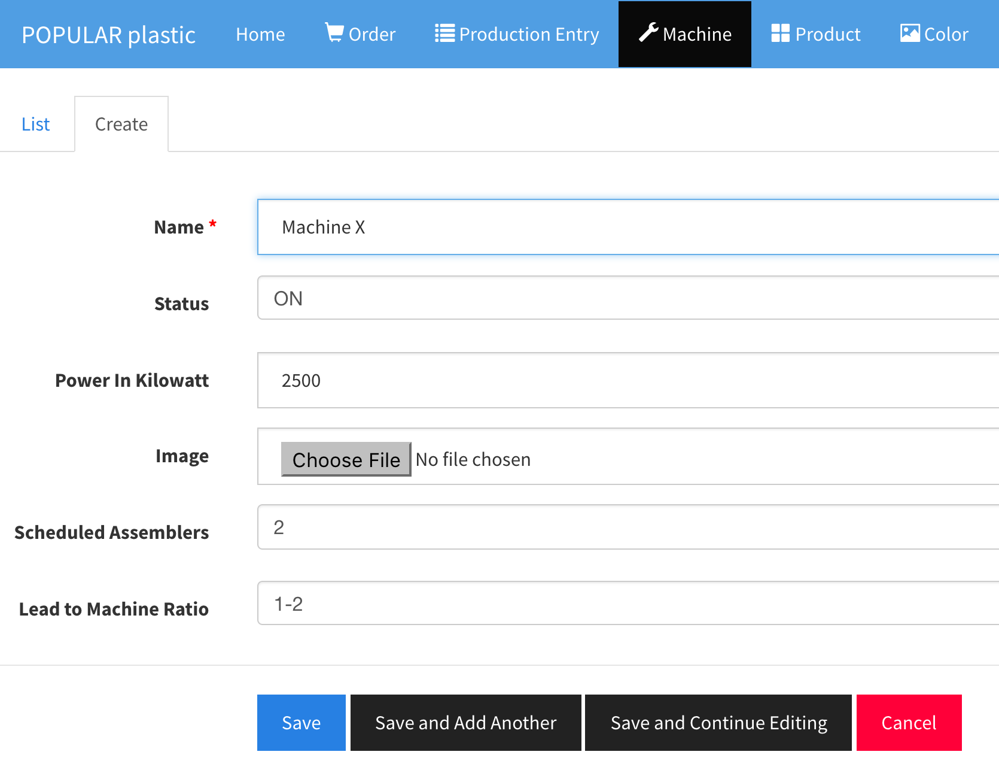
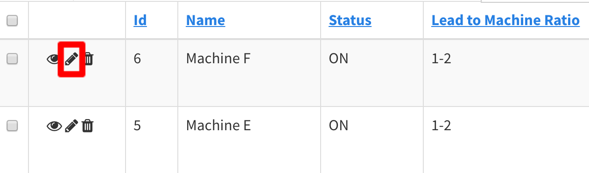
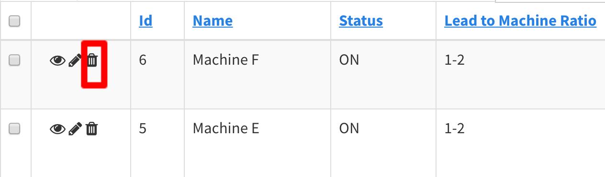

# Machine

Machines are required for the order and production entry creation, and team scheduling.

## Add New Machine

In the `Machine` section, click on `Create` tab.

* Machine name should be posted on the actual machine so that the user can match during the data entry.
* Status has 
    * ON 
    * OFF (shut down to save power)
    * BORKEN (currently fixing on the issues)
    * NOT_IN_USE (No longer used or deprecated)
* `Team Request` uses all the machine except the ones with the `NOT_IN_USE` status.
* Machine photo field is optional.
* `Scheduled Assemblers` is the total number of assemblers to be used in the `Team Request` process a.k.a. scheduling.
* `Lead to Machine Ratio` is the ratio of how many machines that you want to assign to a lead. Example: 1-2 means `one lead - two machines`. 

## Update Machine

Click on the `pencil` icon to edit a machine details.

## Delete Machine

Click on the bin icon to delete a machine.

## List Machine

List all the Machines. There are some important columns to notice:

* `Scheduled Assemblers` Column

This column shows the number of scheduled assemblers (workers). The `Team Request` [Employees > Team Request] uses this number to form a team. `x2` means two assemblers will be assigned to that machine.

* `Orders` Column

This column shows the number of assemblers of the current `IN_PROGRESS` order, excluding lead, required by the product. Once the order is completed, the product icon will be disappeared.

1. If `Scheduled Assemblers` > `Orders` xN counts, that means the machine is overstaff.
2. If `Scheduled Assemblers` < `Orders` xN counts, that means the machine is understaff.

