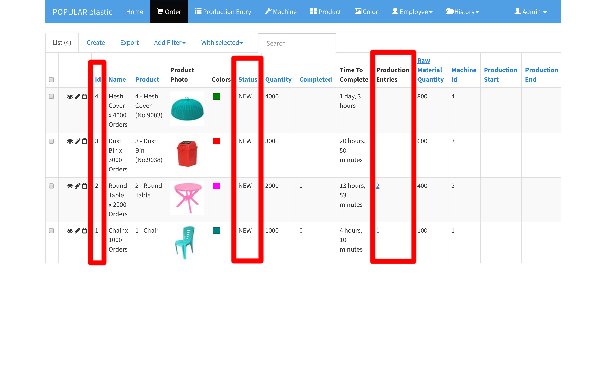
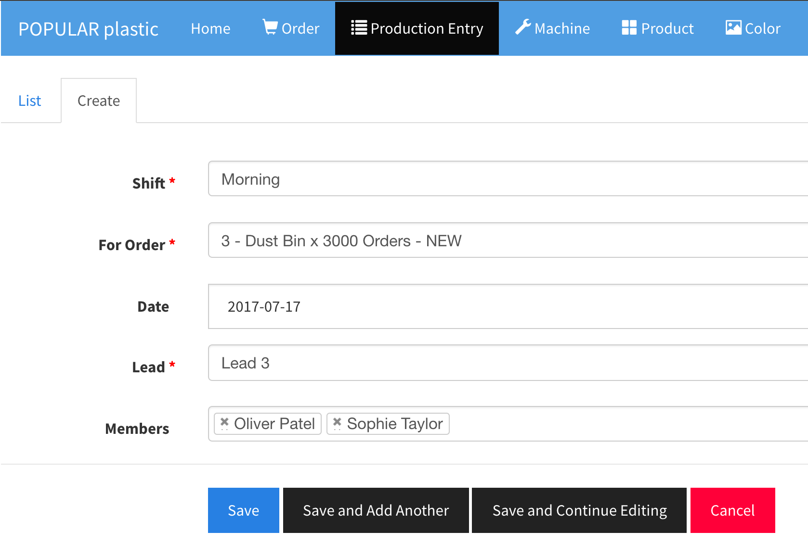
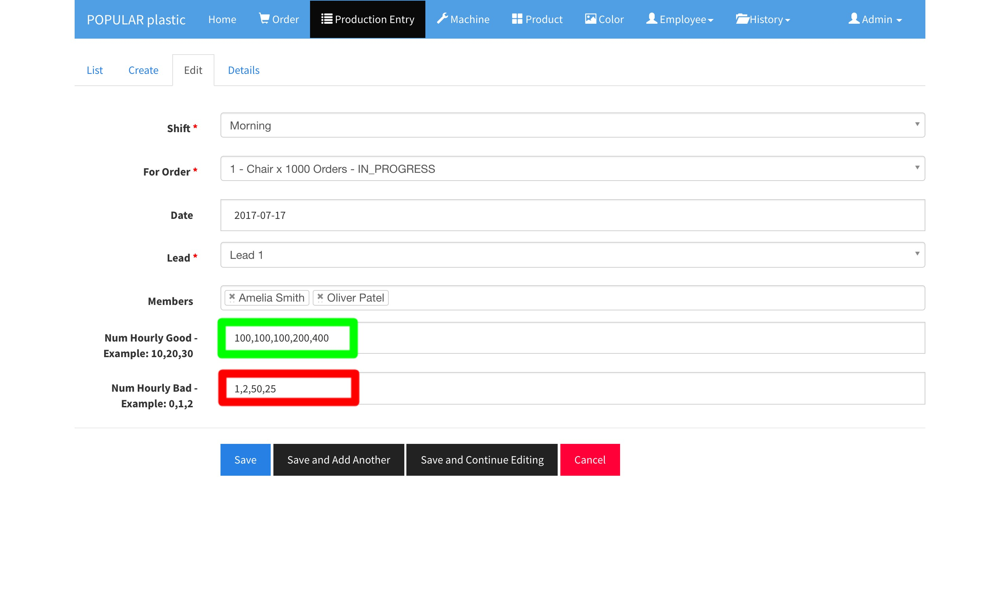

# Orders and Production Entries

## 1. Check Orders
Once you have setup Machine, Color, Product, Shift, User, and Team; you can now start processing orders by creating a production entry for each order per machine.

Before you create a new Production Entry, first view the order list and check for 

* Order Id
* Order with the 'NEW' Status
* Order with no production entries

You may want to create new production entries for the new Orders without production entry. The only condition you want to create another production entry for the `IN_PROGRESS` orders is:

* The order is still `IN_PROGRESS` when a Shift is ended.

In the above list, you will see that Order Id 1 and 2 already have production entries (Id: 1 and 2), but their status is still 'NEW'. Why? It is because the someone has created production entries and they have not started the production yet. 

In the Order Id 3 and 4, there is no production entry and these orders are the ones that you need to create production entries for current shift with the assiged team for the assigned machine Id.

> The production Entry creation should happen at the assigned machine for a given order while meeting the scheduled team.

## 2. Create Production Entries

Now, click on `Production Entry` tab from the menu bar and see the existing production entries.

Ideally, this production entry creation process can be done by a manager or lead who will walk down the machine lanes and create production entires for the orders with these conditions:

* The `IN_PROGRESS` orders with carryover from the previous shift.
* The `NEW` orders based on the order id in ascending order: 1, 2, 3, etc..

Click `Create` tab to creat a new production entry. In the new production entry form:

* Select current shift
* Select the order
* Select team lead name who is currently assigned to the machine.
* Select all team members who are currently assigned to the machine.
* Finally, click `Save`.

Repeat the same steps for all the orders that you want to process for the current shift.

[Create Order Video](https://player.vimeo.com/video/225953269)

## 3. Update Production Entries

Before you update a production entry, check `Remaning` count first. Click edit button :black_nib: on the production entry that you are going to update.

Update hourly number of good and number of bad in comma-separated format: `100,125,110`

[Update Production Entries Video](https://player.vimeo.com/video/225956412)

