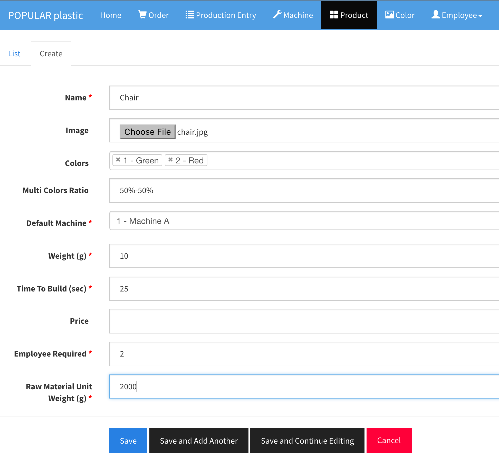

# Product

Product is the core part of the production management system and it has relationship to production entry, machine, color, and user or employee.

## Create Product

A product is defined by the following fields:

| Field | Type | Description |
|-------|------|-------------|
| Name  | String | Unique product name | 
| Image | PNG, JPG or JPEG | product photo - File size: the smaller is the better. Image file name must be unique! |
| Colors | Color | one or more colors |
| Multi Colors Ratio* | String | If a product has multiple colors, you can define a ratio: 50% (Green) - 50% (Red), 50+50 = 100 quantity |
| Default Machine | Machine | In production of any order for this product, this default machine will always be used. |
| Weight (g) | Integer (x > 0) | Product weight in gram. The value must be greater than zero. |
| Time To Build (sec) | Integer (x > 0) | Estimated time to build one item in seconds. |
| Price | Integer (x > 0) | Selling price (Optional) |
| Employee Required | Integer (x > 0) | Number of assemblers required excluding the team lead |
| Raw Material Unit Weight (g) | Integer (x > 0)| Raw material single unit (per bag) weight in gram |

> *If you do not want multi-colors combination, you can simply setup a different product for each color.

## View details, Edit, and Delete

Same as Machine's view, edit, and delete.