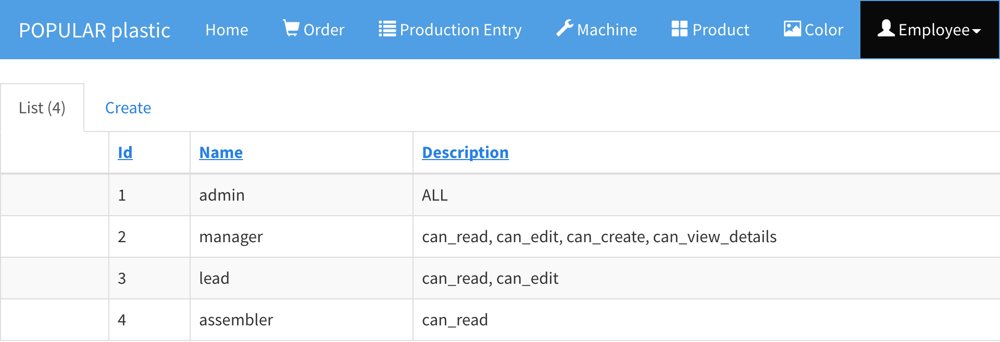

# Role

A role defines a set of permissions and it can be assigned to users. By default, the application comes with the following roles:

| Role | Permission |
|------|------------|
| assembler | can_read |
| lead      | can_read, can_edit |
| manager   | can_read, can_edit, can_create, can_view_details |
| admin     | can_read, can_edit, can_create, can_view_details, can_delete, can_export |

In order to update production entries, one needs to have at least the `lead` role. Even if you create a new role, you cannot apply any permission to it as these roles are pre-defined and built into the application.

