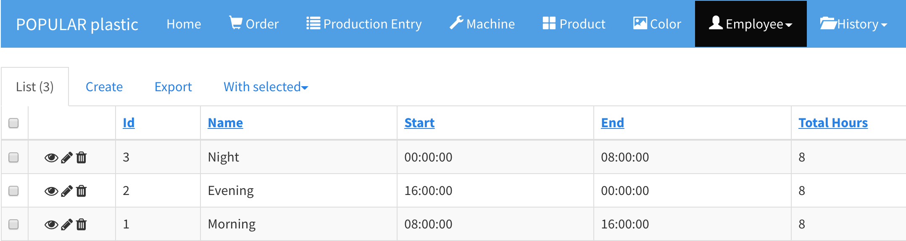

# Shift

A shift is a working hour time window in 24-hour day.

Go to `Employee` > `Shift` to view, edit, create, and delete shifts.

The total hours for all shifts must be less than or equal to 24 hours.

