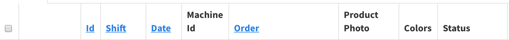
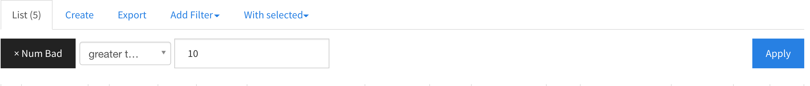
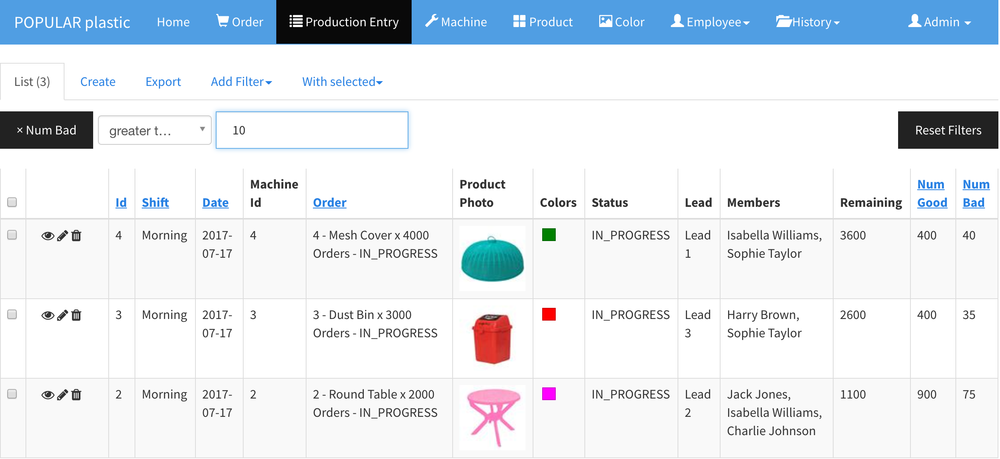

# Sorting and Filtering

## Sorting

Any blue clickable column names are sortable. For instance, 

 

In the above table, the `Id`, `Shift`, `Date`, and `Order` columns are sortable.

## Filtering

`Add Filter` > [Column Name]

Filters can be used to filter and search records based on one or more criteria.

> Example: filter any production entries with the number of bad is greater than 10.

### Search Result

