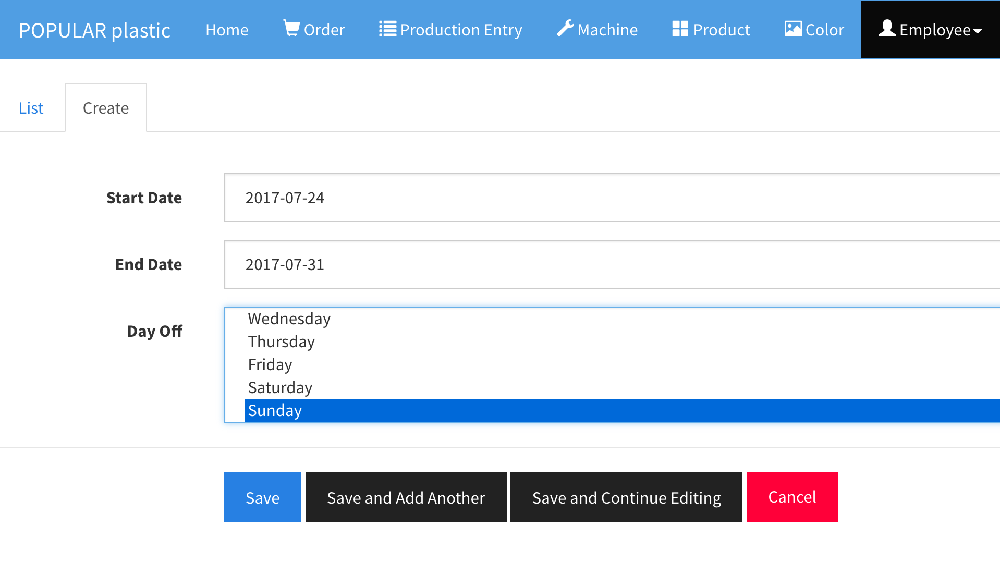
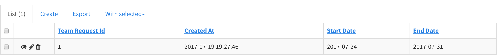
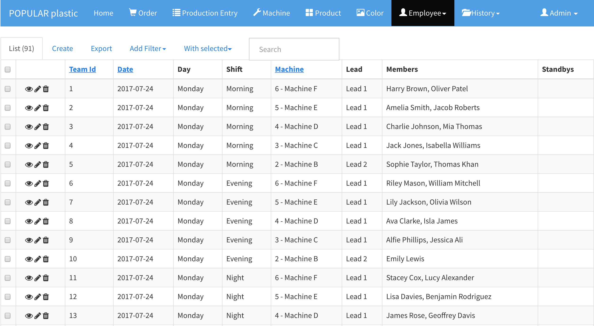

# Team Request and Team

## Team Request 

`Employee` > `Team Request`

In order to create teams for any number of days, you need to submit a `Team Request`. The team request will check:

* 1. Employee availability (isActive or not) and filter out the `lead` and `assembler` roles
* 2. Machine availability excluding `NOT_IN_USE`.

and it will then form teams by `randomly` selecting the `assembler` and `lead` users and using

* 1. Scheduled Assemblers  
* 2. Lead to Machine Ratio 

settings defined in each machine. For example, if Machine A sets `Scheduled Assemblers` to `2`, the team request/builder will allocate two assemblers to the Machine A and likewise to `lead`.

In the above screenshot, a new team request is making for one week schedule with Sunday as a day off.

### Team Request List

> Unlike other entities, do not try to edit any team requests as it will not re-generate (re-schedule) the teams.

## Team

Once you submit a team reqeust, you can check the output (teams) a.k.a `Schedule` at `Employee` > `Team`.

> When you have more assemblers/leads than the number of machines, all extra assemblers and leads will go into `Standbys`. The `Standbys` resources can be distributed into any understaff machines.

### View, Edit, and Delete 

You can view team detials, edit, and delete teams if needed.

