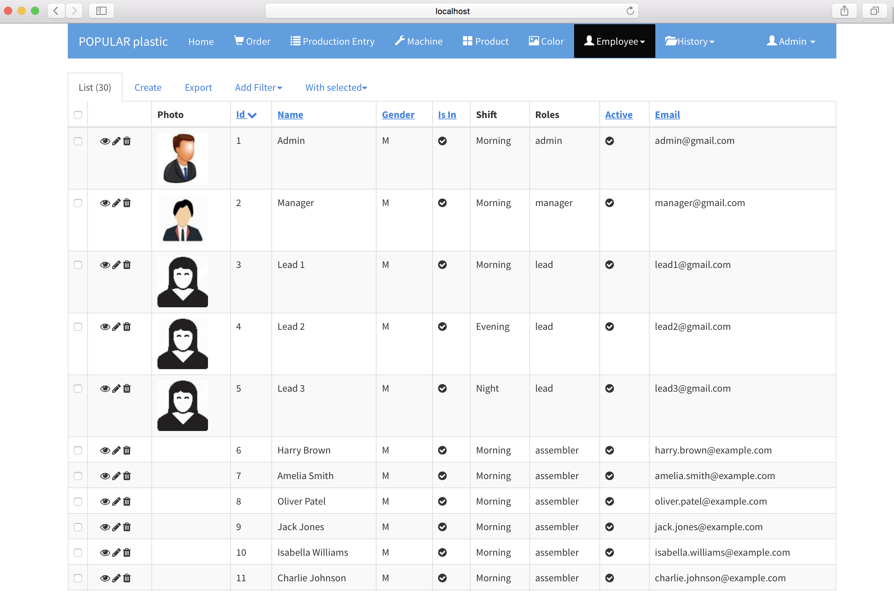

# User

`Employee` > `User`

User is one essential entities for the application to work beginning from log in to team scheduling.

## Add User

New user can be added via 

1. `Employee` > `User` : __Create__ tab or 

| Field | Type | Description
|-------|------|-----------
| Name  | String | User/Employee fullname
| Gender | Option | `M` for Male, `F` for Female 
| Email | String | Email is required for users who need to login to the application.
| Password | String | Password in this form is plain text so other can see it. If you want user's password encrypted, use the below approach to create new users.
| Roles* | Option | Select a role from the dropdown list or you can leave it as empty if you do not want the user to access the application. 
| Shift | Option | Select a shift for the user
| Phone | String | User phone number
| Active | `YES/NO` | `YES` - User works for the company, `NO` - User no longer works for the company.
| Is In | `YES/NO` | `YES` - User is checked in, `NO` - User is out.
| Image | PNG, JPG, JPEG | User photo

> `Team Request` (Scheduling) uses `Active` users with either `lead` or `assembler` role only. Other roles are excluded.

2. `Login` page > `register for an account` link at the bottom of the page.

## View, Edit, and Delete

`Employees` > `User` 

Same as others.

